# Semana 02 - Sistemas Operativos

##🐧 Entorno

¿Qué distribución y versión de Ubuntu utilicé?
Utilicé la distribución de Ubuntu ejecutándose en el entorno de desarrollo asignado para la práctica.

¿Qué terminal utilicé?
Utilicé la terminal estándar de Bash en Ubuntu.

##🆔 Procesos

¿Qué es un proceso?
Es un programa en estado dinámico de ejecución que se encuentra cargado en la memoria RAM y al cual el sistema operativo le ha asignado recursos activos de CPU y memoria.

¿Qué diferencia existe entre programa y proceso?
El programa es un archivo estático y pasivo guardado en el disco duro, mientras que el proceso es ese mismo programa ejecutándose de forma activa en la memoria del sistema.

##📊 Diagnóstico

¿Qué información obtuve mediante ps?
Obtuve una vista básica de los procesos que están asociados de manera inmediata a la sesión actual de la terminal.

¿Qué información obtuve mediante ps aux?
Obtuve una fotografía global y detallada de todos los procesos activos en el sistema, mostrando el usuario propietario, el PID, los porcentajes de consumo de CPU y memoria, el estado y el comando exacto.

##🌳 Relación padre-hijo

¿Qué proceso padre identifiqué?
Identifiqué a la shell Bash como el proceso padre principal que coordina y ejecuta las acciones de la terminal.

¿Qué procesos hijos encontré?
Encontré los comandos ejecutados desde la terminal, como las instancias de sleep o los comandos de consulta del sistema.

##📈 Monitoreo

¿Qué observé mediante top?
Observé el comportamiento dinámico del sistema en tiempo real, viendo el consumo de CPU y memoria de los procesos activos.

##🧪 Procesos de laboratorio

¿Qué procesos creé?
Creé procesos de prueba utilizando el comando sleep 300 para simular pausas prolongadas.

¿Qué PID tuvieron?
Tuvieron los números de identificación asignados por el sistema durante la práctica, como los PID 47047, 47337 y 47338.

¿Cómo los identifiqué?
Los identifique utilizando el filtrado de búsqueda con el comando ps aux | grep sleep.

##🛠️ Administración

¿Cómo finalicé los procesos de laboratorio?
Los finalicé de forma segura ejecutando el comando kill seguido exclusivamente del número de PID correspondiente.

¿Cómo comprobé que terminaron?
Comprobé que terminaron volviendo a ejecutar ps aux | grep sleep y verificando que la línea del proceso ya no aparecía activa.

##⌨️ Primer plano y segundo plano

¿Qué diferencia observé?
El primer plano bloquea la terminal impidiendo escribir nuevos comandos hasta que finaliza, mientras que el segundo plano permite que el proceso corra de manera independiente liberando la línea de comandos.

¿Qué comandos utilicé?
Utilicé el símbolo ampersand (&) para enviar procesos al fondo y el comando jobs para consultar su estado.

##⚙️ Prioridad

¿Qué investigué sobre nice?
Investigué que permite modificar la prioridad de ejecución de un proceso, con valores que van desde -20 hasta 19.

¿Qué resultado obtuve?
Obtuve la comprensión de cómo se puede ajustar la atención que el procesador le otorga a un proceso frente a otros.

##🔬 /proc

¿Qué información encontré?
Encontré directorios nombrados con números que coinciden con los PID de los procesos, conteniendo archivos detallados como status y cmdline gestionados directamente por el núcleo.

##🔄 Multiprogramación

¿Qué observé al tener varios procesos ejecutándose?
Observé cómo múltiples instancias independientes de sleep coexisten al mismo tiempo en el sistema, alternándose el uso de los recursos del procesador.

##🧠 Reto: diagnóstico

¿Qué problema simulé?
Simulé un escenario de revisión y control de procesos activos para identificar consumos y administrar el sistema correctamente.

¿Qué proceso investigué?
Investigué los procesos de laboratorio generados con sleep y los procesos principales de la sesión.

¿Qué información encontré?
Encontré sus identificadores únicos, sus estados y la relación jerárquica con la terminal.

## 📊 Comparación de herramientas

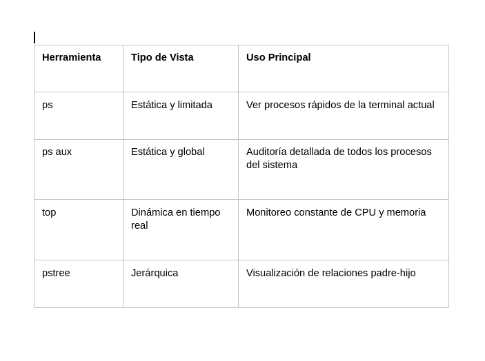

##🧪 Antes y después

Antes del experimento el sistema se encontraba en su estado base; durante el experimento se generaron y monitorearon procesos de laboratorio adicionales; y después de aplicar la administración con kill, el sistema regresó a su estado inicial limpio y libre de procesos huérfanos o de prueba.

##⚠️ Seguridad

¿Qué riesgos existen al administrar procesos?
El principal riesgo es finalizar por error un proceso crítico del sistema o del usuario root, lo que puede provocar inestabilidad grave, pérdida de datos o el cierre forzoso de la sesión operativa.

## Conserva capturas o registros que permitan demostrar el proceso.

Como mínimo:

##🐧 Sistema Ubuntu identificado.

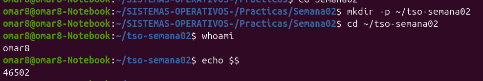

Muestra la terminal abierta en la distribución de Ubuntu con el nombre de usuario activo (omar8) y la ruta del directorio de trabajo de la práctica.

##🔎 Salida de ps.

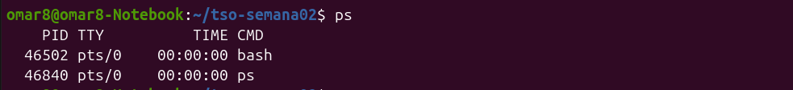

Muestra los procesos básicos que están asociados directamente a la sesión actual de la terminal

##📊 Salida de ps aux.

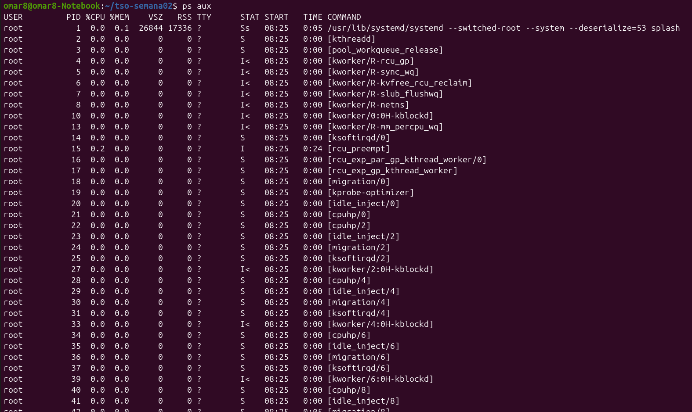

Muestra la lista completa de todos los procesos activos en el sistema operativo, incluyendo las columnas de usuario, PID, porcentajes de CPU y memoria, estado y comando

##🌳 Relación padre-hijo.

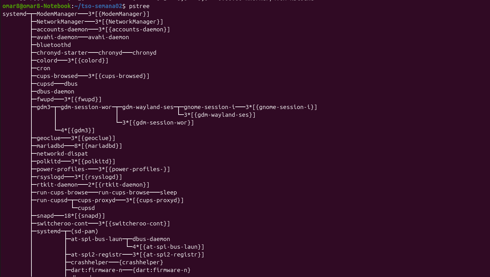

Muestra el árbol jerárquico de los procesos en ejecución, permitiendo identificar visualmente qué proceso funge como padre y cuáles son sus procesos hijos.

##🖥️ Observación mediante top.

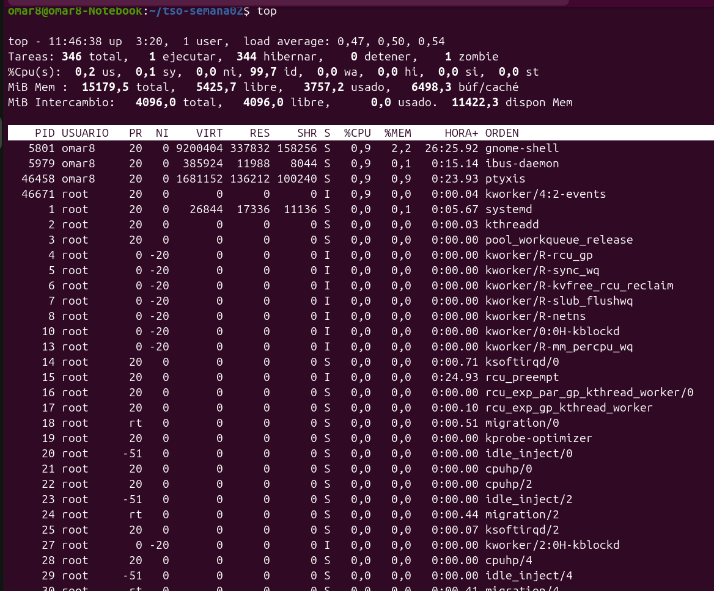

Muestra la interfaz dinámica de top con la fluctuación constante en el consumo de recursos de CPU, memoria y la lista de procesos activos.

##🧪 Proceso sleep creado para laboratorio.

Muestra el momento exacto en el que se ejecuta el comando sleep 300 para generar una pausa controlada en la terminal.

##🆔 Identificación del PID.

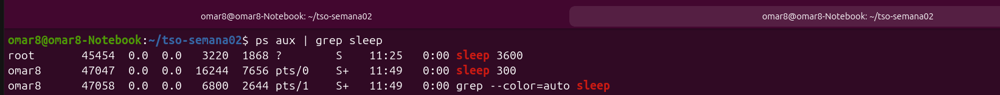

Muestra el resultado de la búsqueda filtrada con ps aux | grep sleep, revelando el número de PID exacto asignado al proceso creado.

##📋 Trabajo en segundo plano.

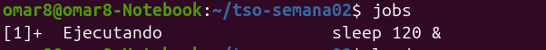

Muestra la ejecución de un comando utilizando el ampersand y la comprobación de los trabajos activos mediante el comando jobs.

##🔬 Información consultada mediante /proc.

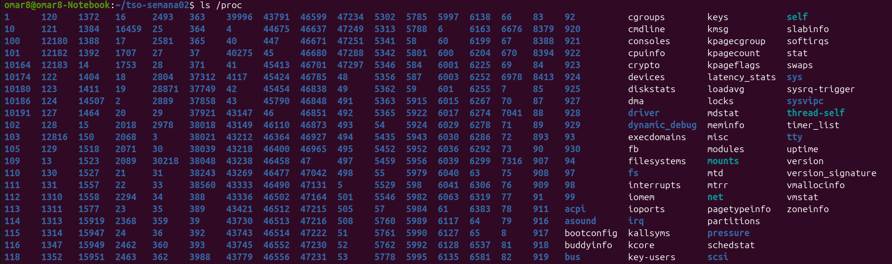

Muestra el acceso y la revisión de la carpeta numérica correspondiente al PID dentro del sistema de archivos virtual /proc

##🔄 Experimento de multiprogramación.

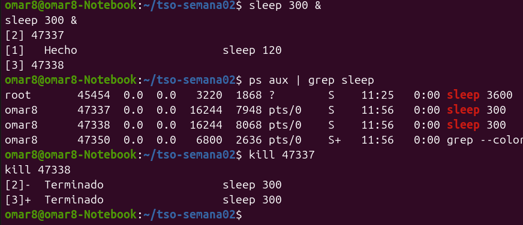

Muestra la ejecución simultánea de múltiples instancias del comando sleep corriendo al mismo tiempo con distintos PID

##🧪 Estado antes y después.

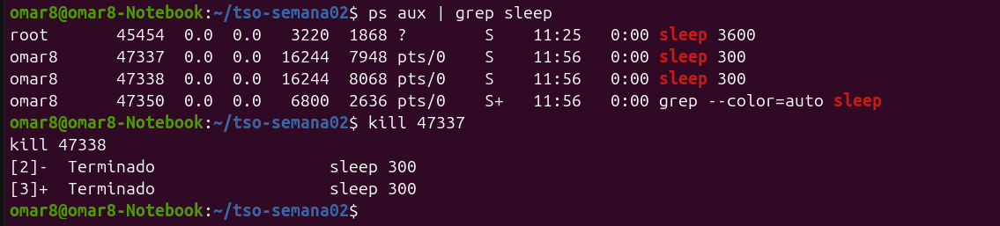

Muestra la secuencia de comparación que evidencia la cantidad de procesos iniciales, la aparición de los procesos de laboratorio durante la prueba y su desaparición tras aplicar la finalización segura con kill
