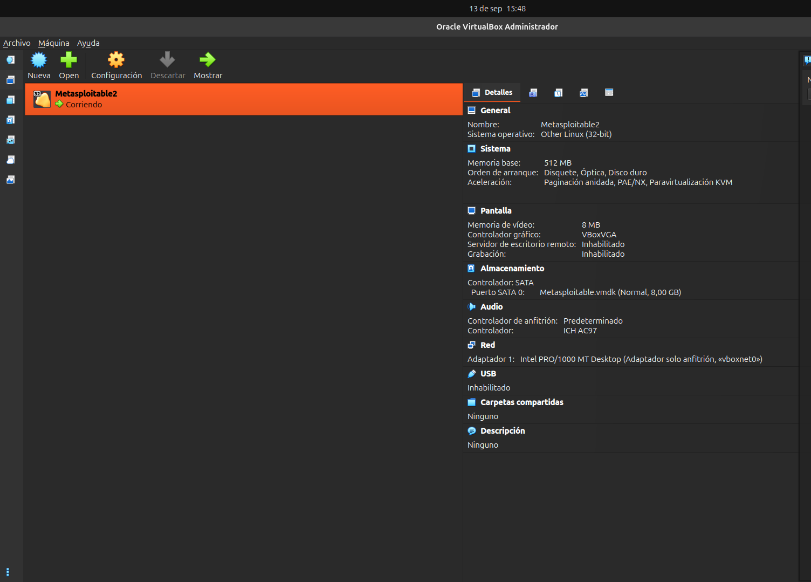
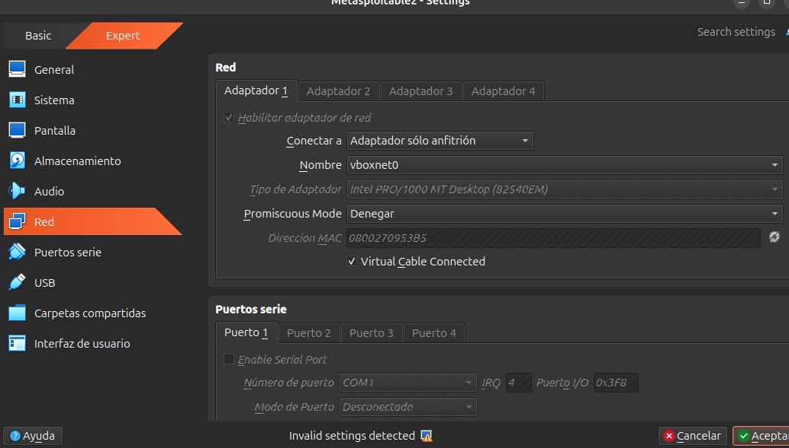
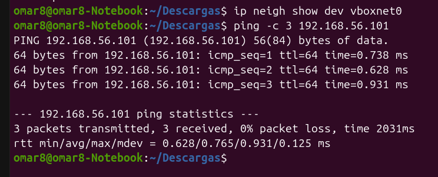
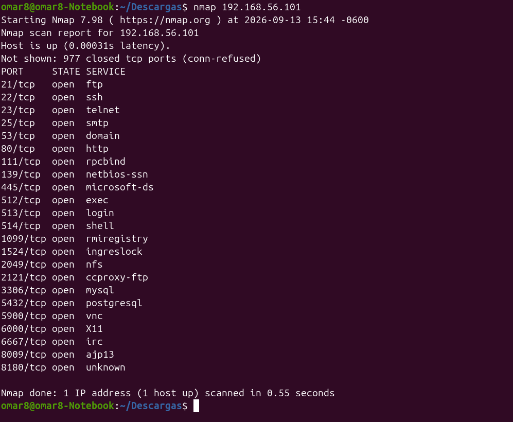

¿Qué diferencia existe entre una máquina virtual y el sistema anfitrión?

El sistema anfitrión es el sistema operativo real que se ejecuta directamente sobre el hardware físico de la computadora, mientras que la máquina virtual es un entorno emulado por software que comparte los recursos físicos del anfitrión pero opera de forma aislada con su propio sistema operativo invitado.

¿Qué función cumple VirtualBox?

Funciona como un hipervisor de tipo 2 que permite crear, administrar y ejecutar múltiples máquinas virtuales de manera concurrente sobre una misma máquina física.

¿Qué es un archivo .vmdk?

Es un formato de archivo que representa un disco duro virtual (Virtual Machine Disk) donde se almacena toda la estructura de archivos, el sistema operativo y los datos de una máquina virtual.

¿Por qué no necesitamos instalar Metasploitable desde una ISO?

Porque Metasploitable 2 se distribuye como una imagen de disco virtual preinstalada y configurada (.vmdk), por lo que el sistema operativo y los servicios vulnerables ya vienen integrados sin requerir un proceso de instalación tradicional.

¿Qué función cumple vboxnet0?

Es una interfaz de red virtual de tipo Host-Only (solo anfitrión) que permite la comunicación directa y exclusiva entre el sistema anfitrión y las máquinas virtuales, manteniéndolas aisladas de redes externas como Internet.

¿Qué significa 192.168.56.0/24?

Representa una dirección de red en el rango IPv4 privado con una máscara de subred de 24 bits (255.255.255.0), lo que permite un total de 256 direcciones IP posibles para los equipos conectados a esa red local virtual.

¿Qué función cumple DHCP?

Es un protocolo de red automatizado que asigna de forma dinámica las direcciones IP y los parámetros de configuración de red a los dispositivos que se conectan a un segmento de red.

¿Por qué Metasploitable no debe utilizar NAT?

Porque el modo NAT enruta el tráfico hacia la red exterior e Internet, lo que expondría la máquina vulnerable a amenazas externas o permitiría que emitiese tráfico no deseado hacia redes públicas.

¿Por qué no debemos utilizar Adaptador puente?

Porque el adaptador puente conecta la máquina virtual directamente a la red física de la institución u hogar, poniendo en riesgo la red local debido a las múltiples vulnerabilidades intencionales que contiene el equipo.

¿Qué información proporciona ifconfig?

Muestra la configuración de las interfaces de red activas de un sistema operativo, incluyendo las direcciones IP asignadas, las direcciones MAC y el estado general de la conectividad de red.

¿Qué función tiene ping?

Permite verificar la conectividad de red entre dos hosts mediante el envío de paquetes ICMP y la medición del tiempo de respuesta y la pérdida de paquetes.

¿Qué información básica proporciona nmap?

Es una herramienta de exploración de redes y auditoría que permite descubrir equipos activos, puertos abiertos y los servicios o versiones que están corriendo en un objetivo.

¿Por qué las pruebas realizadas en esta práctica están autorizadas?

Porque se ejecutan en un entorno  controlado, aislado y propio (laboratorio académico), utilizando una máquina virtual diseñada de forma deliberada para la educación y la investigación en ciberseguridad.

¿Qué riesgo existiría si Metasploitable se conectara a una red institucional?

Cualquier equipo de la red podría comprometer fácilmente los servicios vulnerables de Metasploitable o, a la inversa, un atacante externo podría utilizarla como punto de pivote para infectar el resto de los equipos institucionales.

Ventana principal de VirtualBox mostrando la máquina virtual 

Configuración del Adaptador 1 de red en modo Adaptador sólo anfitrión

Verificación del controlador de almacenamiento SATA con el disco virtual de solo lectura Metasploitable.vmdk conectado correctamente

Comprobación de la conectividad de red mediante el comando ping desde el sistema anfitrión Ubuntu hacia la dirección IP 192.168.56.101, registrando un 0% de pérdida de paquetes

Escaneo inicial de puertos y servicios con la herramienta nmap 

