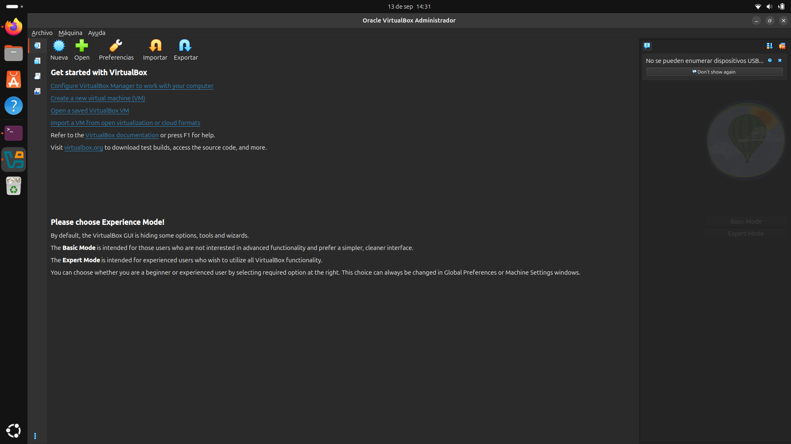
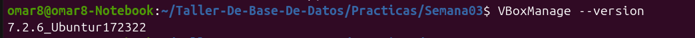
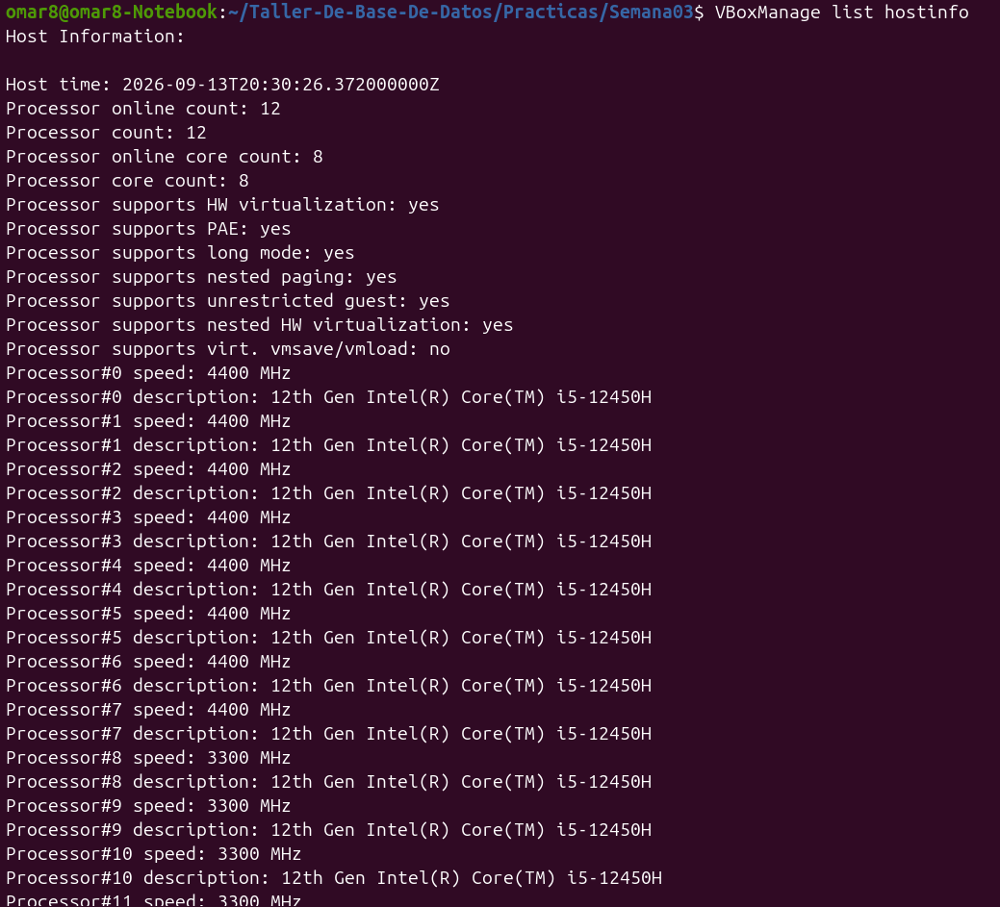
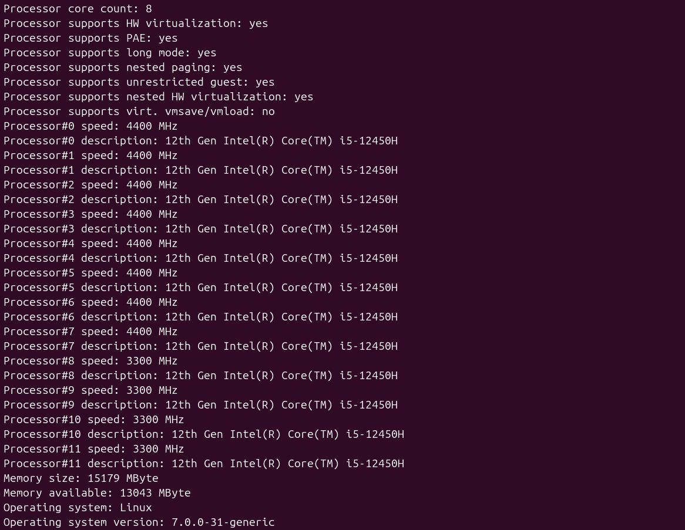

-Nombre del alumno: Omar Said Duarte Ruiz

-Fecha: 13 de septiembre de 2026 (o la fecha en que lo estés documentando)

-Versión de Ubuntu: Ubuntu 26.04 LTS 

-Arquitectura: x86_64

-Versión de VirtualBox: 7.2.6

-Instalación exitosa: Sí 

ventana principal de VirtualBox ejecutándose correctamente 

versión instalada de VirtualBox en el sistema (versión 7.2.6).

Detalle del hardware y recursos del equipo 
